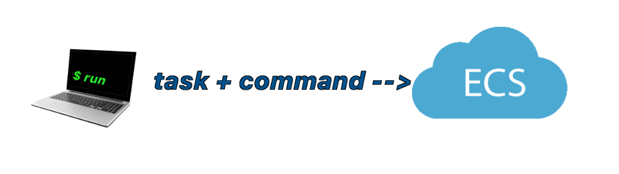

From time to time we all miss the command line prompt.  It can be frustrating when you just want to run a command and monitor its output while you wait for it to finish, but instead you wind up having to go through a series of detailed steps to find the cluster, then an instance, and run the command.

Wouldn't it be nice to be able to run a command interactively, and see its output in the terminal?   Answer prompts by typing.  Just like you where there.
ECS is great for running containers for services, but when you want to run something simple and see the output it feels impossible.

The `aws ecs run-task` and `ecs-cli compose run` commands are asynchronous.  Once they start a container, its expected to run independently.  To run something interactive, you would have to make a container that waits for you attach to it, then find the instance that its running on, ssh to the instance and use `docker exec` to attach to the running container.   That's not very easy and not well suited for running ad-hoc commands.

Manually running a command on ECS isn't as easy you might hope because ECS is designed to run Docker containers inside Tasks that are defined by TaskDefinitions and they write their output to a log file.   It's the exact opposite of running interactive commands.  To manually run an interactive command on ECS, you would have to first choose a cluster, then an EC2 instance inside the cluster, ssh to the instance and run commands yourself.

The ssh command (secure shell) can get you to the instance, but the instance may be a bare-metal server without any of the tools or software that you need because the real business software has been built into Docker images.   Need a django admin shell with settings to connect to the database?  You'll need to start a Docker container, but not just any Docker container.  You'll have to choose an image to run, being sure to get the right version of the image for your cluster if you're on a staging or production, and you may need environment settings and even mounted volumes to give the container the information that it needs to run.

That's a lot to get right, and it's definitely not easy or fast.  Even worse, if you get something wrong you could wind up connected to the wrong database or running an alpha version of your software in production.

The first solutions that come to mind aren't much better.  No one would want to define a TaskDefinition for each command we want to run, then run it, check the logs .... repeat ad nuaseum.   But what if we ssh to an EC2 instance, and use `docker exec` to step inside with an interactive bash shell in one of the containers that are already running?   That will work, but it might also affect the performance of the container, or blow up its memory footprint.  And what would happen if ECS decided that the container was no longer healthy, or needed to be stopped for other reasons.  Our work could get cut off in mid-sentence.

# ssh-ecs-run-task
**ssh-ecs-run-task** solves these problems for you, giving you your own **interactive** container running on an instance in your cluster by combining the power ssh, an existing Task and **your command**

**ssh-ecs-run-task** uses ssh to give you an interative terminal session into a container running your command on an EC2 instance.  You can use this to run a django admin shell, or a mysql client, or even a bash shell.   You can start by choosing an existing TaskDefinition already defined to run on your cluster to pick the right version of the right Docker image, and copy all the environment settings, mounted volumes, containers, and **add your own command to run**.

**ssh-ecs-run-task** takes the given task; queries ECS to determine its containers, environment, volumes and image; ssh's to a randomly chosen instance in the cluster and runs the your command in a new container.

For example, suppose we would like an interactive bash shell to run on our user-registration-service on the alpha cluster.  Under ECS, we already have a TaskDefinition **ecscompose-user-registration-service--alpha** to run that service, so lets use that as our starting point or template.  (Or you can create a new TaskDefinition for admin stuff)

		$ ./ssh-ecs-run-task --task ecscompose-user-registration-service--alpha -- bash
		RUNNING bash on user-registration-service-ecs-alpha-i-fc975765
		# ps -ef
		PID TTY TIME CMD
		1 ? 00:00:00 bash
		2 ? 00:00:00 ps -ef
		#
		# echo "DATABASE_NAME=$DATABASE_NAME"
		DATABASE_NAME=use-registration-db--alpha
		# exit
		$ echo $?
		0

Whoa – that was easy!   What just happened? **ssh-ecs-run-task** simply:

+ Guesses the cluster for ecscompose-user-registration-service--alpha to be user-registration-service--alpha. (you can override this with the **--cluster** flag if that's not correct)
+ Queries ECS to determine the task's docker image and version, environment settings, mounted volumes and list of containers
+ Chooses the first container (you can override this with the **--container N** or **--container \<name >** option)
+ Queries ECS to choose a random instance from the cluster (you can override this with **--instance N** or **--instance \<pattern>**)
+ Formulates an ssh command to run as yourself (or **--ssh-user \<user-name>**) on the chosen instance, to run a remote docker command passing **-e VAR=VAL** and **-v VOLUME**, image and your command as arguments to `docker run`
+ Runs the ssh command giving you a terminal and a prompt if the command is interactive.
+ Stays connected until the command completes or you type **^C** to interrupt it.
+ Cleans up the processes, removes the container, and terminates the ssh connection.

This winds up running an ssh command to run the docker container using the right image version and settings.

	ssh -t user-registration-service-ecs-staging-i-9a13cd03 docker run -it \
	     --rm -e 'DATABASE_NAME=audience_profile_service' [-e N1=V1 -e N2=V2 ...] user-registration-service:1.6.0 bash

So why did `ps -ef` only show two processes?  That's because these are the only process running inside the new docker container.

Also notice that the environment variables such as $DATABASE_NAME have all been defined just like they are for the ecscompose-user-registration-service--alpha task.

Finally, notice that when we exited successfully and that the exit code **0** was set in shell **$?** variable, so we can tell that the command succeeded.

## Installation
+ Install Python 2 or Python 3.
+ `pip install ssh-ecs-run-task`
+ or clone this git repository and run `make install-global`

**ssh-ecs-run-task** requires you to pre-install [ecs-cli-0.4.x or higher](http://docs.aws.amazon.com/AmazonECS/latest/developerguide/ECS_CLI_installation.html) and the [json tool](https://github.com/trentm/json) version 9.0.3 to 10.x.x. Version 11 is not currently supported.

## Usage
    USAGE: ssh-ecs-run-task [+e +v] --cluster <cluster-name> --task <task-name> --container <container-name> [docker options] -- command and options

    Outputs command-line options and image for use with `docker run` to run
    a new container with settings from the given task.

    General Options:
        --verbose               print verbose output
        --debug                 print debug output
        --non-interactive       do not pass the -t flag to ssh or the -it flags
                                to docker to allocate a tty

    DNS Options:
        --domain <domain>       the DNS domain for all EC2 instances

    TASK_LIKE Options:
        +e                      do NOT COPY environment variables from the Task
        +v                      do NOT COPY volumes from the Task
        --image <image>         use given image for the task
        --tag   <tag>           use given tag for the image 

    Docker Run Options:
        should be listed before the -- command

        -w|--workdir
        --user <user>                                pass --user <user> thru to the docker command
        --sudo 		                                 use sudo to run the docker command 
        --sudo-<flag>                                passes -<flag> to the sudo command  
        --sudo-<flag> <arg>                          passes -<flag> <arg> to the sudo command

    CLUSTER Options:
        --cluster    <cluster-name>                  cluster on which to run
        --task       <task-name>                     AWS task definition name to mimic
        --container  <container-name or index>       name or index of container in task (defaults to 0 for the first)
        --instance   <instance-id or index>          name or index of EC2 instance in cluster (defaults to -1 for random)

    SSH Options:
        --ssh-user   <user>                          defaults to your current ssh config
        --ssh-<flag>                                 passes -<flag> to the ssh command
        --ssh-<flag> <arg>                           passes -<flag> <arg> to the ssh command

ssh-ecs-run-task inspects the container in the task to determine its environment, volumes and image, ssh's to the chosen instance and runs the command in a new container

##Examples
+ Run a bash shell inside a container.  `ssh-ecs-run-task --task ecscompose-user-registration-service--alpha – bash`
+ Print the environment.  `ssh-ecs-run-task --task ecscompose-user-registration-service--alpha – /usr/bin/env`
+ Check connectivity from inside the container.  ` ssh-ecs-run-task --task ecscompose-user-registration-service--alpha – ping -c 5 google.com`
+ One-Shot admin commands such as  `./ssh-ecs-run-task --task ecscompose-user-registration-service--production -- django-admin user_brand_grant 3000486 4628`

###Passing flags to `docker run` and the command
Everything (including flags) after the special `–` double dash separator is part of the command to run.  Everything before the double dash is treated as either a recognized option for ssh-ecs-run-task, or an option to `docker run`.

	$ ssh-ecs-run-task --task ecscompose-user-registration-service--staging --user nobody  --entrypoint bash --instance fc975765 -- -c id -a
	uid=65534(nobody) gid=65534(nogroup) groups=65534(nogroup)

In the above example, the **--task** option is used supply a task name to `ssh-ecs-run-task`,  the **--entrypoint** and **--user** options pass through to the `docker run` command to set the entrypoint to **bash** and the user to **nobody**.  After the double dash **--**,  the -c option is processed by the bash shell to say "here are some bash commands", and then running `id -a` inside the container, showing the effects of the --user flag.

###Passing Quoted Arguments to the Command
The bash command supports a handy -c 'string' option that allows you to pass a short script to run in the form of a string.  But ssh likes to eat white space so, if you run the command ssh user-registration-service-ecs-staging-i-9a13cd03 bash -c 'cat /etc/hosts' will actually run `cat` instead of `cat /etc/hosts`.    To avoid this problem, simply enclose double quoted strings with single quotes like this:

	$ ssh user-registration-service-ecs-staging-i-9a13cd03 bash -c '"cat /etc/hosts"'

###Passing options to Ssh
For long running batch commands you may want to use the **-o ServerAliveInterval=30** option to `ssh` so it will periodically tell the remote ssh server that its still alive.  You might also want to use the **-q** option to suppress extra output.  To pass options to ssh, just prefix the option with **--ssh-** like this

	$ ssh-ecs-run-task --task ecscompose-user-registration-service--staging --ssh-o ServerAliveInterval=30 -- <some-long-running-command>

**ssh-ecs-run-task** knows which options to ssh take arguments, and handles them all correctly.

###Passing options to the `docker run` command
All other options that appear before the double-dash '**--**' will will pass thru to the docker run command. 

    $ ssh-ecs-run-task --task ecscompose-user-registration-service--staging --add-host regsvc.com:127.0.0.1 -- <some command to start an http server>

###Running Batch Commands
Batch commands that never prompt for input, will run to completion and **ssh-ecs-run-task** will stop and remove the container and terminate the ssh connection.  So you can use it in Jenkins scripts, cron jobs and other non-interactive use-cases where you want to capture the output and know if the command succeeded or failed.

+ **exit codes** --  If the command failed, **ssh-ecs-run-task** will exit with the same exit code.
+ **stdout & stderr** -- **shh-ecs-run-task** will capture the stdout and stderr from your command and write it to the same channels on your shell.  So you can redirect stdout or stderr to a file or whereever you choose.

You may find these ssh options useful for running batch commands, to avoid some prompts, verbose output, and timeouts

   	$ ssh-ecs-run-task --ssh-q --ssh-o StrictHostKeyChecking=no --ssh-o ServerAliveInterval=30 --task <task-name>

###Stopping a Container
Sometimes things go wrong.  The command you are running may get hung or you may realize that you've run the wrong command, (like  `rm -rf foo /*` instead of `rm -rf foo/*`).  If your container uses (dockerfy)[https://github.com/SocialCodeInc/dockerfy] as its entrypoint, then when you type the ^C aka <ccontrol>C character or kill your ssh,  dockerfy will catch the SIGINT, SIGQUIT, SIGTERM, SIGHUP and shutdown the container.   Without dockerfy, some commands just hang.   How your command reacts depends on how well it handles signals through ssh and docker.   So using dockerfy as the entrypoint is highly recommended.  With dockerfy as the entrypoint, dockerfy runs your command, and listens for signals (which will propagate to your command), and the container will get cleanly shutdown when your command finishes.

##Permissions
To run this script you will have to have been granted all necessary permissions.  **It is not a backdoor**, just an easier path to the front door.  So you will need ssh access to the instance, and the account that you use for ssh on the instance will need permission to run the docker command.   Pulling images from public repositories should always work, but to pull images from private repositories on dockerhub the account will also need to be authenticated via `docker login` credentials.  

Some systems may rely on `sudo` to limit access and log all calls to the docker command.  In those cases, setup a user account to have permission to run docker and to be authenticated on dockerhub.   You can test this by logging in as the user and trying to run docker commands and pull private images.  If it doesn't work at the shell prompt, its not going to work for ssh-ecs-run-task either.

### sudo
On some EC2 instances, you may need sudo privileges to run the docker command.  If so, then use the **--sudo** flag to tell ssh-ecs-run-task to use `sudo`.  The `sudo` command can be configured on the EC2 instance to give users a limited set of commands to run, and it logs all their actions.  To pass options and arguments to the `sudo` command, prefix the options with `--sudo-` like this:

    ssh-ecs-run-task --sudo--user <user> --sudo-i --sudo-g <group> --task <task-name>
    
to cause ssh-ecs-run-task to invoke the `sudo` command like this:

    sudo --user <user> -i -g <group> docker run ....
    
**ssh-ecs-run-task** knows which options to sudo take arguments, and handles them all correctly.  However, some options such as --shell, --prompt, and --background are forbidden.  If you use any --sudo-<flag>, then --sudo is implied as well.

##Caution
As spiderman's uncle once said, "with great power comes great responsibility".  So please don't use this handy tool to wreck your system by running dangerous commands without thinking.

###Proper Uses:
Running tasks where you want or need to see the output directly, such as a database migration. You could use even this script to create an interactive django shell to perform ad-hoc maintenance via`ssh-ecs-run-task --task ecscompose-user-registration-service--alpha -- django-admin shell`.  Proper uses:

+ interactive django shell
+ Jenkins build scripts
+ cron jobs
+ interactive mysql client

###Improper Uses:
+ Changing the configuration of the system with temporary fixes that are not factored back into chef or Github.   This is very dangerous – it can leave you with a system that works but cannot be reproduced!
+ Any unauthorized access or changes.
+ Relying on this command instead of actually designing your system to have a proper management features.

## Limitations
The **ssh-ecs-run-task** command relies on **ssh**, **ecs aws**, and **docker**, so it is limited to doing things that you could otherwise manually do, but with more effort.
